<a href="../terms_of_use/" class="btn-info"> Terms of use</a>
<a href="../start_using/" class="btn-info"> Start using</a>
<a href="../self_service/" class="btn-success"> Self-service guide</a>
<a href="../openstack_flavors/" class="btn-info"> ETAIS flavors</a>



## Overview
ETAIS self-service portal is a single entry point for provisioning and managing computational and storage resources
shared by ETAIS consortium members - UT, TTU, NICPB and HITSA - as well as public cloud providers. It is aimed at
research groups affiliated with Estonian research and development institutions from both public and private sector.

> Access it at [https://minu.etais.ee](https://minu.etais.ee).

Self-service portal offers research groups a way to collaborate on using and sharing research infrastructure to
minimise bureaucracy of negotiating access, quotas and payments.

The main concepts are as follows:

* **Organization** is representing a customer of ETAIS. Organization is responsible for the 
actions of users connected to it in different [roles](#roles). Organizations that provide Offerings are called
Service Providers
* **Project** is an entity within an organization that aggregates and isolates teams and resources.
* **Offering** is a concrete service provided in Marketplace that can be ordered.
* **Resource** - Represents an instance of an Offerings. For example, it can be a Virtual Private Cloud or quota in a batch processing queue.
* **User** - Represents end-users of the system (humans or robots).

ETAIS self-service portal is based on [Waldur](https://waldur.com) cloud brokerage platform. The latest documentation is available from
[docs.waldur.com](http://docs.waldur.com). Below are key aspects adapted for ETAIS deployment.

## Marketplace

Marketplace provides a common way to provision resources.

The following resource categories are offered at the moment:

* Private clouds - a pool of resources dedicated to a particular organization.
* Virtual Machines aka VMs (requires pre-provisioned VPC) - a server with network connectivity for running customer payloads.
* Block Devices (requires pre-provisioned VPC) - persistent volumes for storage of the data.
* HPC - access to SLURM-based processing farms.
* Platform - access to Slurm-based processing farms.

### Private clouds in more details
* Private Cloud (aka Virtual Private Cloud / VPC) is a compute service that allows procuring and managing a pool of virtualized infrastructure
resources - like RAM, CPU, storage volumes and network resources - required to run virtual machines.
* VPC limits define total resources available in a cloud for creating virtual machine and volumes.
* VPC limits can be changed at any moment.
* Private clouds are accounted on a daily basis with the price of the most expensive set of limits during that day.

## User accounts
ETAIS self-service portal supports user accounts coming from [TaaT](http://taat.edu.ee) federated identity system,
which allows to use home organisation accounts for login. Most of the larger education and research institutions in
Estonia are connected to TaaT already.

Alternatively, one can login using an account from [eduGAIN](https://www.geant.org/Services/Trust_identity_and_security/eduGAIN).

Self-Service Portal is available from: [https://minu.etais.ee](https://minu.etais.ee)

> *NB! Users need to accept Terms of Service presented on the first login for account activation!*

## Workspaces
ETAIS self-service is built around the concept of workspaces. Workspace defines structural context for the 
user. Each workspace type shows information and possible actions relevant to the user in a certain role.
There are several workspace types available in the system:

* [Organization workspace](#organization-workspace)
* [Project workspace](#project-workspace)
* [User workspace](#user-workspace)

## Roles
Users are connected to the organizations and their projects through roles. Users may have several roles, specific to
each workspace they have access to. Currently the following roles are available in the system:

* Organization owners (owners)
* Project managers (managers)
* System administrators (admins)

User roles are hierarchical in a way that organization owners can do everything that project managers and system administrators can do.

### Organization Owners
* Can access organization workspace.
* Can invite other users to participate in the organization.
* Can create and manage projects, including policies and cost limitations.
* Can do everything that project managers and system administrators can do.

### Project Managers
* Can access project workspace when appointed by organization owner.
* Can manage project team from the users already connected to the organization.
* Can do everything that system administrators can do.

### System Administrators
* Can access project workspace if appointed by organization owner or project manager.
* Can provision and manage cloud resources.

## User workspace
User workspace is a personal profile management space. It allows to configure user notifications,
SSH public keys, update personal profile data etc.

Menu entries available within user workspace:

* **Dashboard**: listing all organizations and projects where user is participating
* **Audit logs**: listing events related to user
* **SSH keys**: managing public SSH keys for the user
* **Notifications**: managing notifications for the user
* **Manage**: editing and updating user profile details

### Accessing user workspace

Access is done by clicking on user avatar and selecting one of the entries from a pop-up menu.

## Adding a public SSH key to a profile
1. Generate your SSH keypair (on Windows: using PuTTYgen, Linux: using OpenSSH).
2. Click "Details" on the left side of the screen.
3. Select "SSH keys".
4. Click "Add SSH key".
5. Paste there contents of a public SSH key.

### Organization and project workspace selector
Navigation between different organization and project workspaces are done with the help of the workspace selector available in the header row.

### Selecting organization workspace
Open workspace selector and click on "Select" button of target organization.

### Selecting project workspace
Open workspace selector, mark target organization and click on "Select" button of target project.

## Organization workspace
Organization workspace allows to manage projects, subscriptions to resource providers and organization members. It is also intended to provide summary, accounting and auditing information regarding organization, projects and providers. To be able to access organization workspace, you need to have a organization owner role.

Menu entries available within organization workspace:

* **Dashboard**: overview of managed resources and projects
* **Projects**: projects management
* **Marketplace**: catalog of Offerings available for provisioning 
* **Analytics**: resource usage reports
* **Audit logs**: event logs related to organization, its projects and resources
* **Team**: management of organization members and their project/role affiliations
* **Accounting**: resource usage accounting information
* **Manage**: management of organization details

### Adding a project
Projects can be added by selecting "Projects" from the menu and clicking on "Add project" button. 

"Create project" form requires you to enter project name and optionally project description. If you need to attach security class label for the project you should select one from the list presented. Submit form by clicking on "Add project" button.

### Inviting a user
User workspace access and role management can be done on two separate levels:

* Organization workspace allows owners to invite users as organization members and to manage their project role assignments.
* Project workspace allows project managers to assign available organization members a role in their project.

Organization level invites can be created by selecting "Team" from the organization workspace menu and clicking on "Invitations" management tab.

For creating a new invitation please click on "Invite user" button.

> *NB! By sending an invite to a user you also accredit this user to become an organization member! In order to complete
the joining process invited user needs to login with the URL provided in the invitation email.*  

"Invite user" form requires target user email address, initial project and role selection. Submit form by clicking on "Invite user" button.

## Project workspace
Project workspace provides tools and information required for day-to-day work and oversight over the managed IT infrastructure. Access is done via workspace selector in the top section of user interface.

Menu entries available within project dashboard:

* **Dashboard**: overview of project resources and latest events
* **Marketplace**: catalog of Offerings available for provisioning
* **Resources**: provisioned resource listings and management views by resource category (VMs, Private Clouds, Storage, etc.)
* **Audit logs**: event logs related to project and its resources
* **Team**: project team management

## Adding a VPC
Virtual Private Cloud (VPC) resource package can be added by clicking to “Marketplace” and selecting “Private Clouds”  from the menu to go to the list of  VPCs.

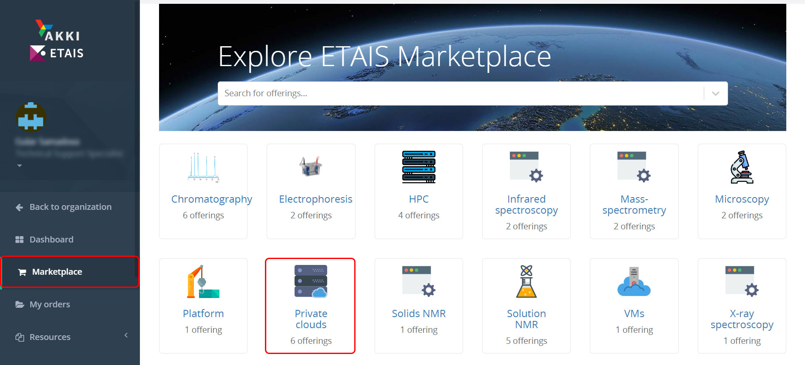

> *NB! There are several Virtual Private Cloud providers available on the Marketplace. You need to provision at least one VPC package from a suitable provider in order to be able to create virtual machines.*

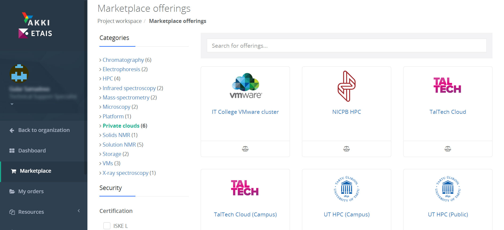

It is mandatory to input “Tenant name“ to order a VPC.

Currently, there are three VPC component names listed: Cores, Ram, and Storage. For configuration of a VPC resource please fill in a suitable quantity for each component and click on the “Add to chart” button. Here by changing the quantities of components, you can see Prices accordingly per day, per 30 days, per 365 days, and finally the total price of the VPC.

We also strongly suggest filling the “Tenant description” field. 

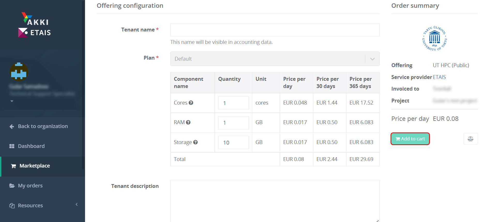

To approve the configuration:

a) If your role in the Project is Project Manager or System Administrator, please ask your ETAIS Organization Owner to approve the order.

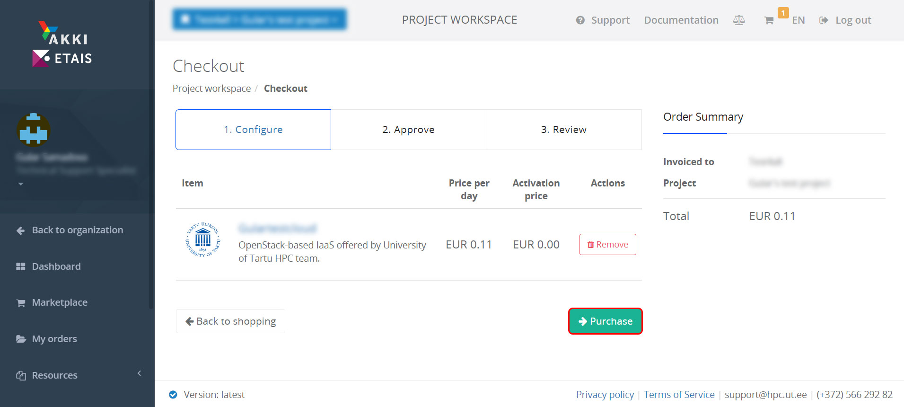

b) If your role is Organization Owner you are able to complete the purchase to final approval (click the “Purchase” button). Hereafter the system will need a couple of minutes to execute the order (see the order status on the image below). Once the system changes the state to “Done”, your VPC is ready to use.

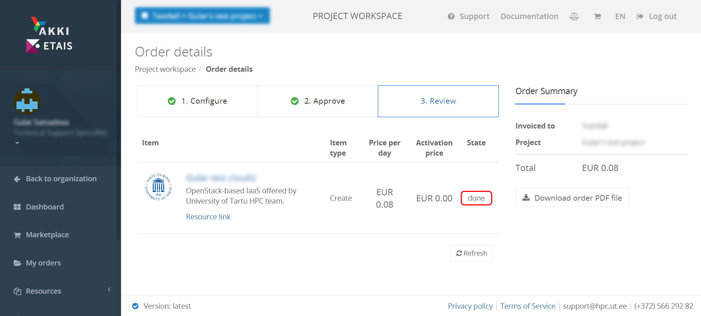

> *NB! Provisioned VPC resource package will be automatically enabled for the project as a VM provider! For other projects it can be enabled by the organization owner under Provider management within organization workspace.*

## Project allocation reports
> *To see the monthly project allocation usage*

- **Step 1:** Login to ETAIS self-service portal using MyAccessID 
- **Step 2:** Open your project in ETAIS Portal.
- **Step 3:** Select the allocation that usage report you would like to see.
- **Step 4:** Click "Usage" to display the report for this allocation. Use tabs "CPU Allocation", "GPU Allocation", and "Storage Allocation" to see the details. 

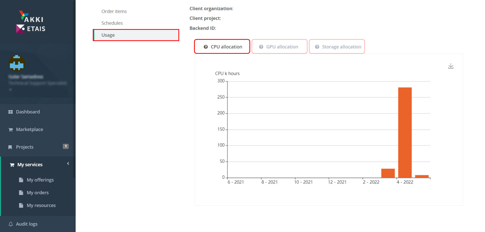

## Adding a VM
> *Projects need to have at least one VPC resource package enabled before any virtual machines can be created! You can follow 
>  [this guide](https://etais.ee/self_service/#adding-a-vpc) to add a new VPC*

VMs can be added by clicking to "Marketplace" and selecting "Virtual machines" from the menu to go to the list of Virtual machines. 

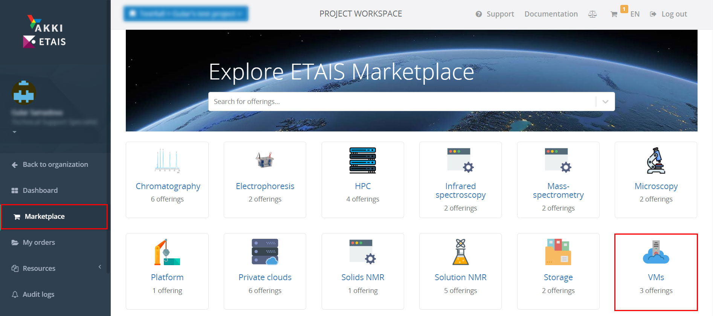

Ordering a Virtual Machine requires a VM name and selection of a VM image.

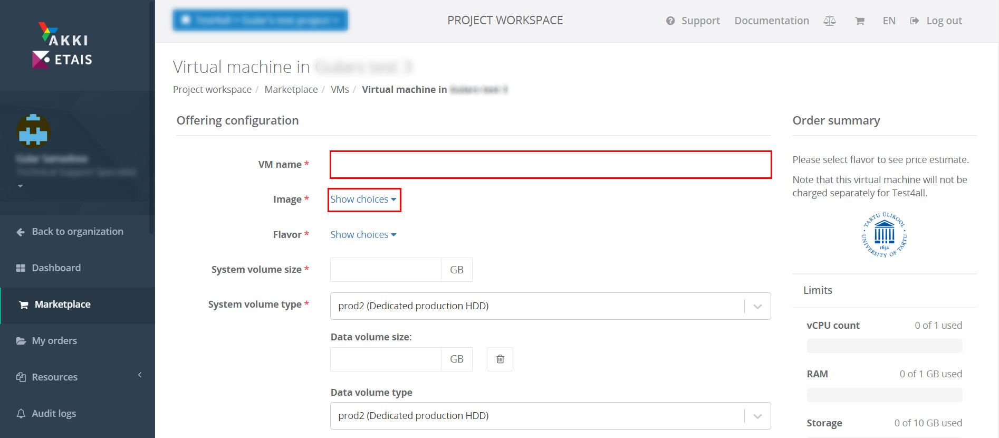

Please select the "Image" for a VM and click on the "Select" button, returning to the form.

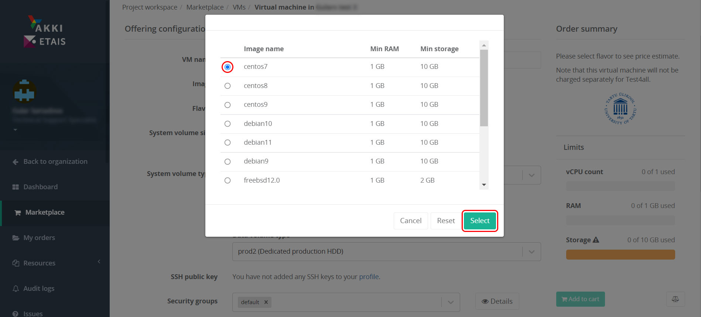

Selecting the initial VM resource profile ie flavor, by clicking on the "Flavor: Show choices" selector is mandatory.

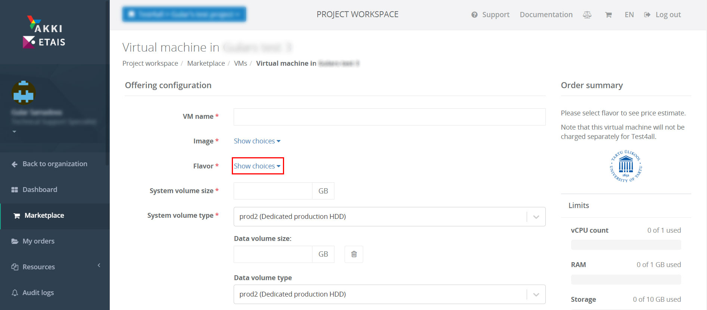

The flavor will set the initial resource profile for a VM - how much RAM, vCPU cores, and storage it will have. 

> *NB! VM images contain their minimum requirements information, and non-matching VM flavors are disabled automatically!*

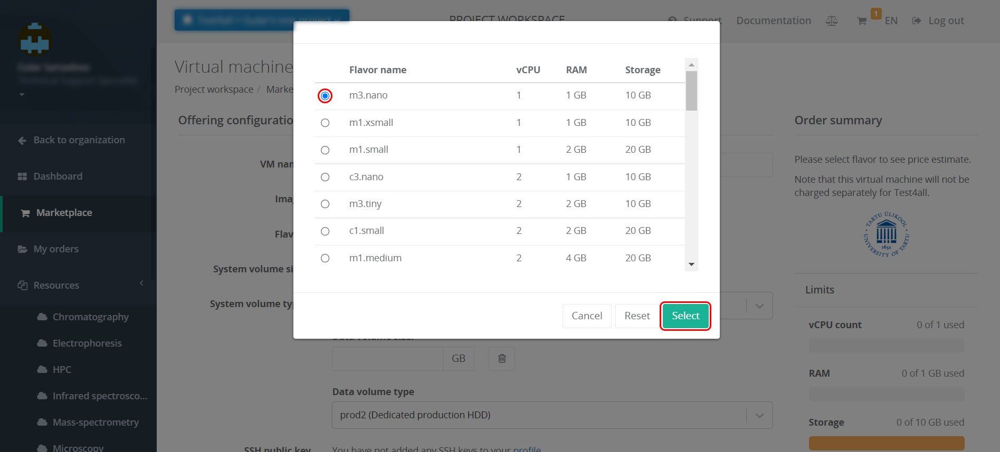

Selecting VM flavor will also update "System volume size" with the option to override it manually (to a higher custom value). The size of "Data Volume" can be customized and incremented in 1GB steps. "System volume" must be at least 10GB, whereas "System volume" and "Data volume" must be equal to or less than VPC’s total Storage.

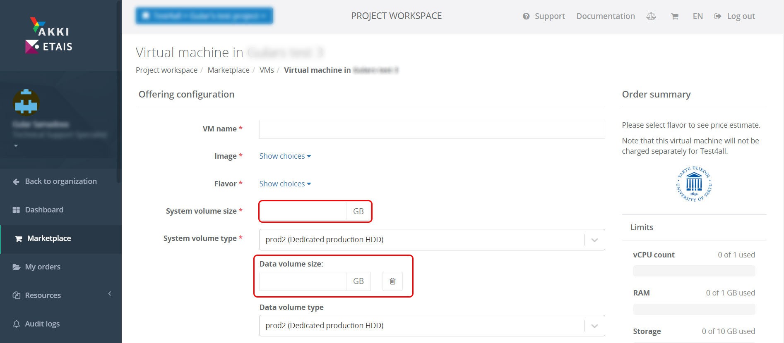

By default, provisioned virtual machines expect users to log in using SSH keys. The initial SSH key for login should be selected by clicking on the "SSH public key: Show choices" selector.

> *There has to be at least one SSH public key added to the user profile for it to appear in the SSH key selector list!*

> *NB! In order to log in to your newly created VM over SSH, you need to use a username depending on your choice of VM Image type and your ssh-rsa key-pair. By default password authentication is disabled.*

Default usernames for login are as follows:
- CentOS images: centos
- Ubuntu images: ubuntu
- Debian images: debian
- FreeBSD images: freebsd

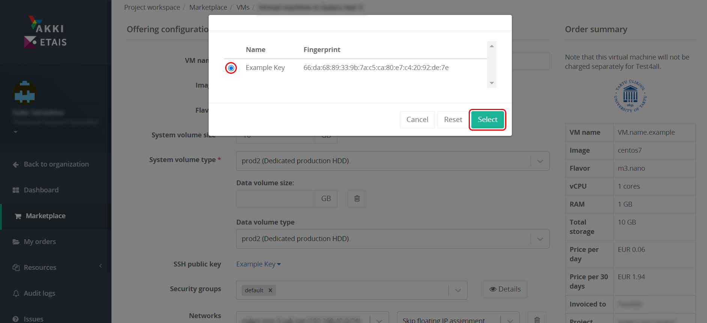

While selecting “System volume type” it should be taken into consideration that prod2 is for production, whereas scratch is for testing purposes only.

> *For production prod2 is recommended because technology used by scratch is not under official support*

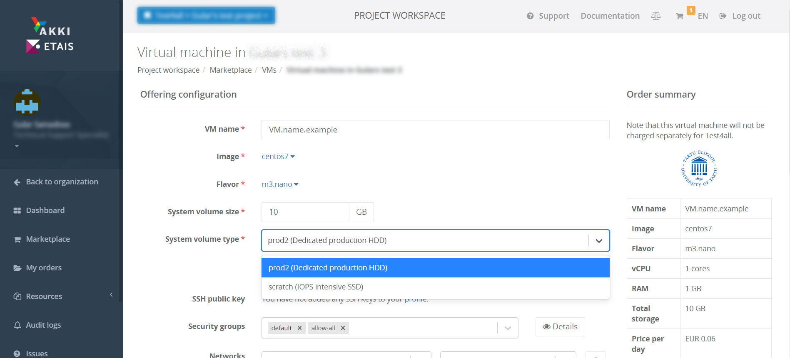

By default, no incoming connections will be allowed for a VM. Predefined Security Groups (firewall rules) must be linked to a VM in order to open up access (like ssh, HTTP, etc.). By clicking the “Details” button, you can see the details about the available Security Groups. Security Groups can be added while ordering the VM or afterward by editing.

> *NB! VM create form will automatically include a "default" security group that enables egress (ie outgoing) traffic for a VM and which is required in order to reply to any of the incoming packets!* 

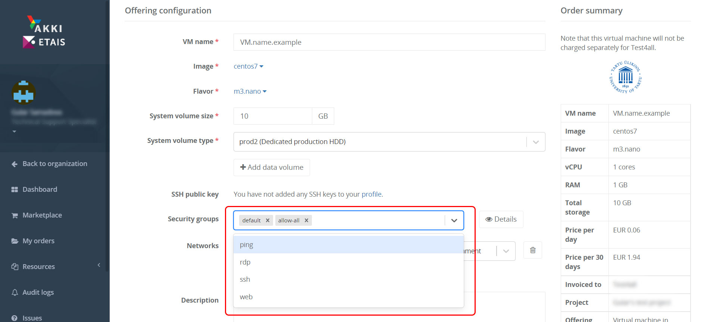

VM needs to be connected to at least one of the VPC (internal) networks and an external network via floating IP - if external/public access to VM is required. 

> *Floating IP is technically realized as 1:1 NAT between VM internal IP and public network IP.*

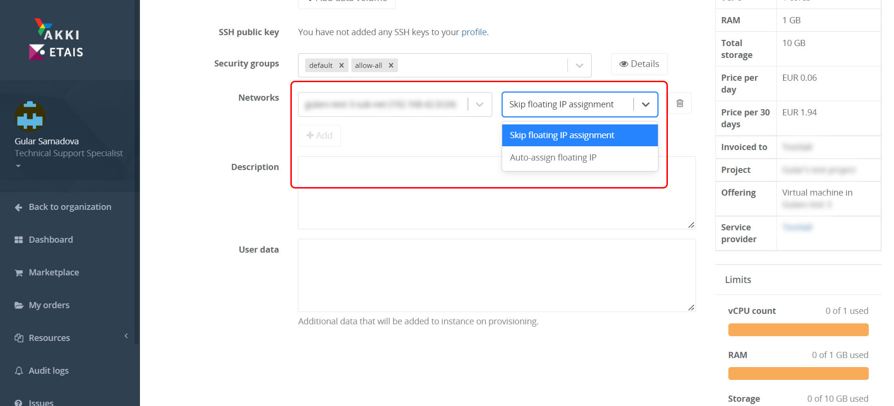

We strongly suggest also adding VM description. In order to provision the VM, please click on the "Add to cart" button.

> *On the right pane, there will be a "Checkout summary" with the purchase overview and indicative VM cost (as part of the VPC package cost).*

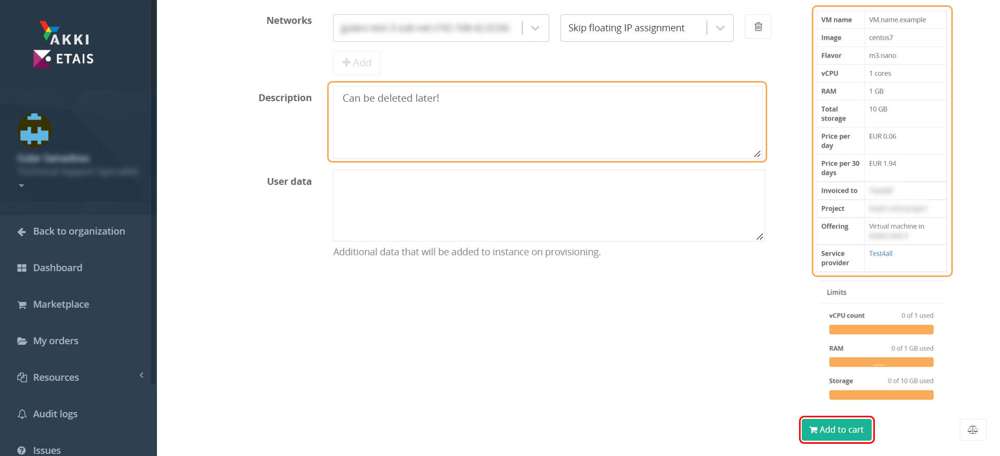

VM should reach into "Active" status when successfully provisioned. The "Access" field will show the IP address to access VM over SSH (Linux) or over RDP (Windows). 

> *VM access over SSH or RDP should be permitted by Security Groups linked to VM!*

> *OpenStack VPC VMs will have an additional 64MB virtual hard disk attached to VM, which functions as a cloud-init configuration drive (not supported by self-service yet, only user-data support at the moment).*

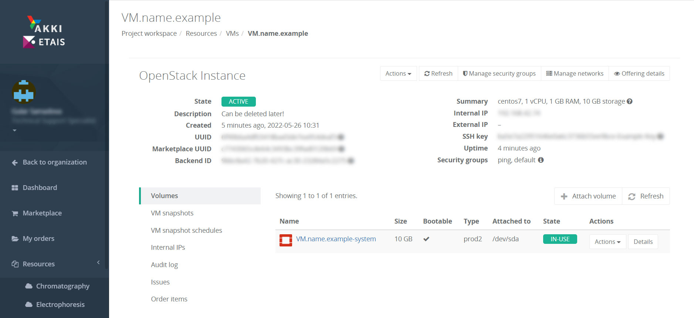

## Adding a Virtual Desktop
### 1. Virtual Desktop Overview
> *Virtual Desktop service is a cloud-hosted Linux desktop machine. The service is free of charge in Beta version. Virtual Desktop (VD)  is available in any web browser, and no client installation is required.*

**What Does it Do**

 - It enables you to create a separate working environment for a specific use, such as keeping your personal and work separated in different computing environments.
 - Easy access to your virtual machine that is entirely in your control.

> *Please note! Only the person who made the VD order, can log into the VD. The service is not accessible for any other team members.*

 - Run the software in a remote and powerful machine.
 - Teach students Linux internals.

**Features**
 - 4 CPU cores, 8GB of RAM, and 10GB SSD storage running on powerful AMD EPYC servers.
 - Low latency with HD video and sound support.
 - Pre-installed web browsers, office, and scientific software.

### 2. Ordering The Virtual Desktop Service 
- **Step 1:** Login to [https://minu.etais.ee](https://minu.etais.ee)

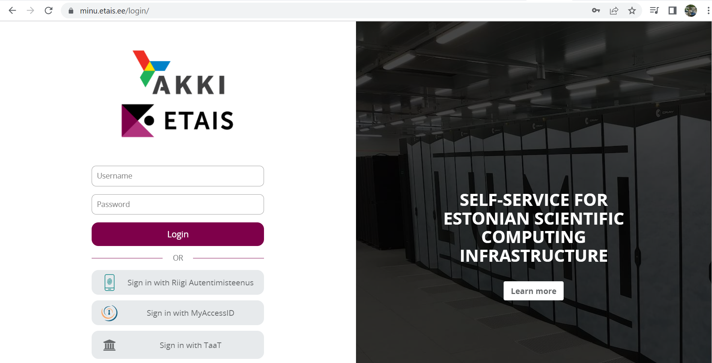

- **Step 2:** Go to Marketplace 

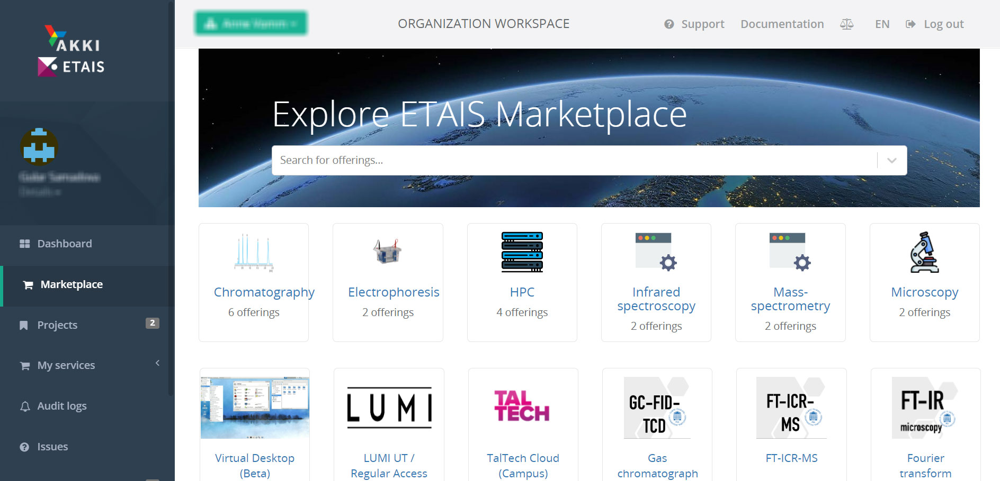

- **Step 3:** After finding a service Virtual Desktop (Beta), fill the field “Name” and add the selection to cart.  

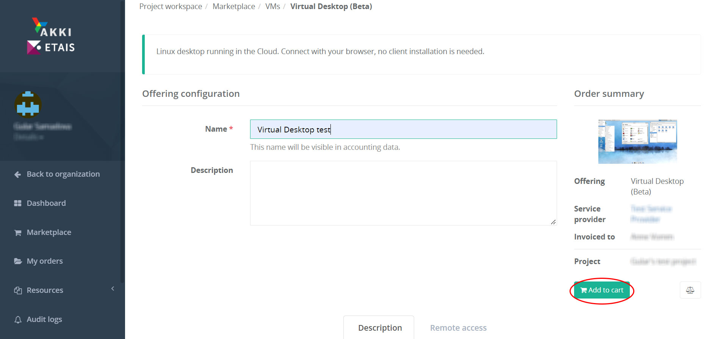

- **Step 4:** To finish the order, please, click “Purchase”.  

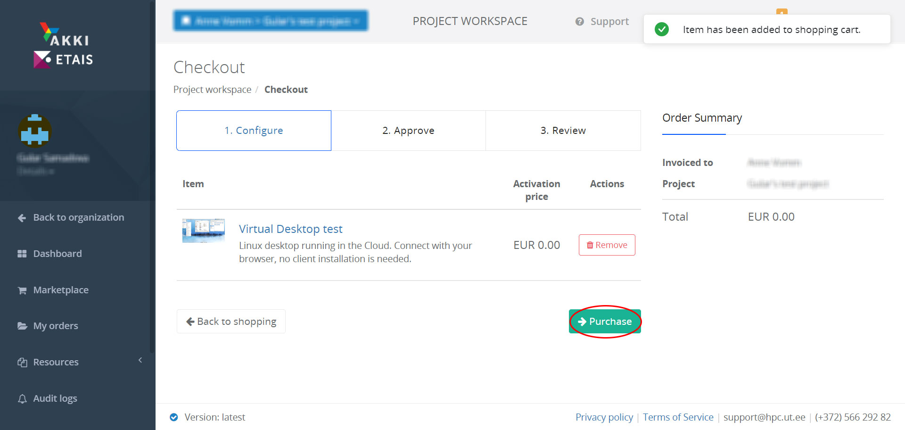

- **Step 5:**

**a)** If your role in the Project is Project Manager or System Administrator, please ask your ETAIS Organization Owner to approve the order. 

**b)** If your role is Organization Owner you are able to complete the purchase to final approval. Hereafter the system will need a couple of minutes to execute the order (see the order status on print screen below). Once the system changes the state to “Done”, your VD is ready to use.

 
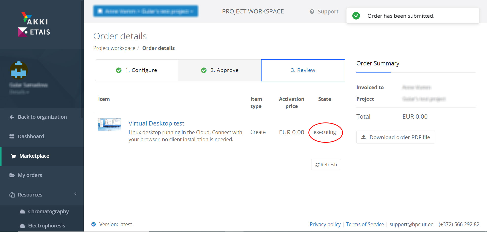

**c)** When the purchase is made by the Project Manager or System Administrator, minu.etais.ee sends a notification to the Owner to review the request. While waiting for the Owner’s approval, the order state remains “Pending”.

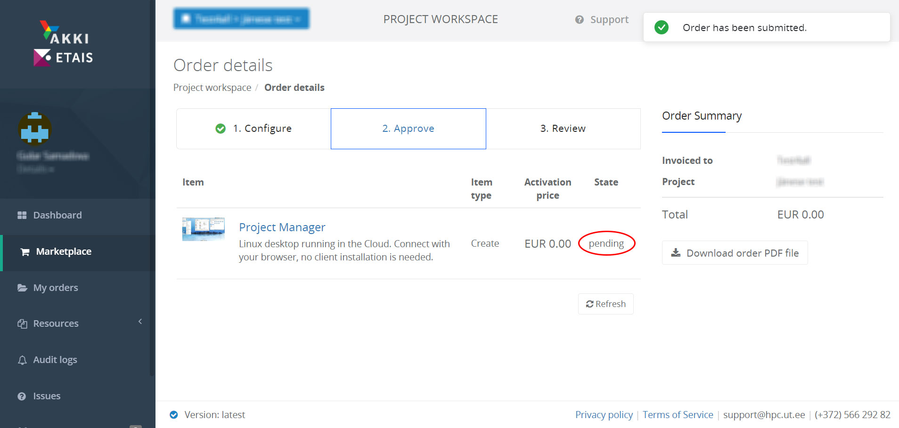

### 2.1. Organization Owner Approving a Service Order 

- **Step 1:** Make sure your are in Organization space (not in Project space).

- **Step 2:** Choose from left menu “My Services/My Orders”. The system will display a list of orders with their State.

- **Step 3:** Click on order with the status “Pending”. 

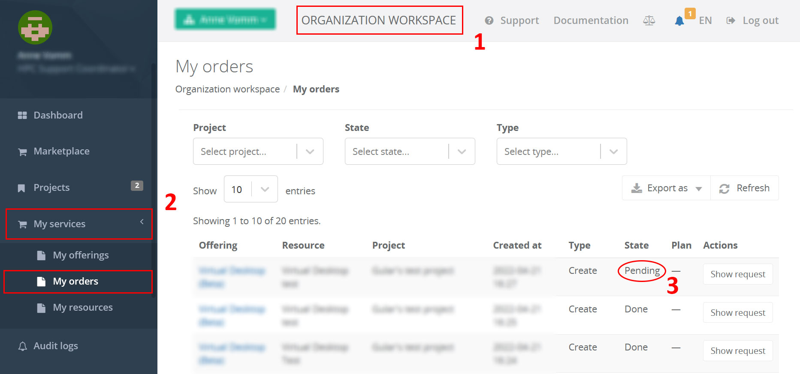

- **Step 4:** Choose the buttons “Approve” or “Reject”. 

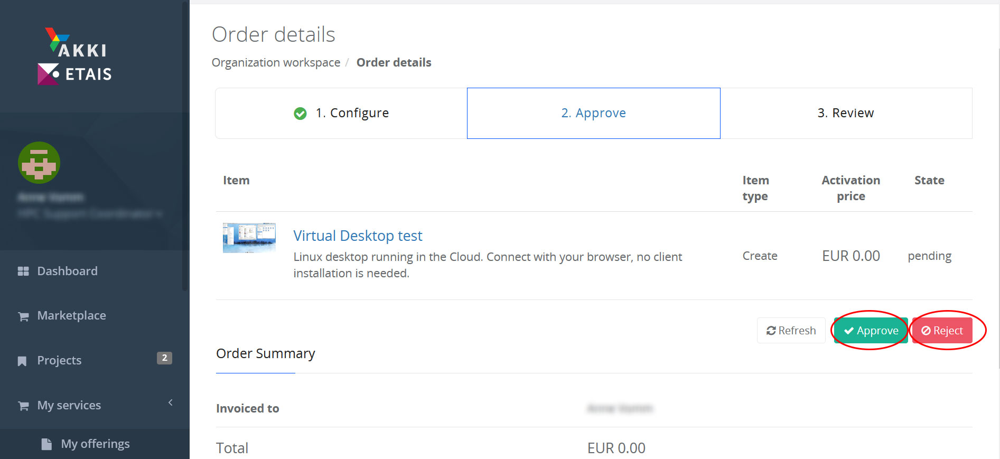

- **Step 5:** Hereafter the system will need a couple of minutes to execute the order. Once the system changes the state to “Done”, your VD is ready to use.

> *Please note! Only the person who ordered the VD, can access the service. If the Owner did not order but just approved it, it is not accessible by the Owner.*

### 2.2 Accessing the Virtual Desktop

- **Step 1:** Access URL [https://desktop.hpc.ut.ee/](https://desktop.hpc.ut.ee/) with MyAccessID Service.
- You can find the guide on how to add your Identity Provider at the bottom of your screen. 

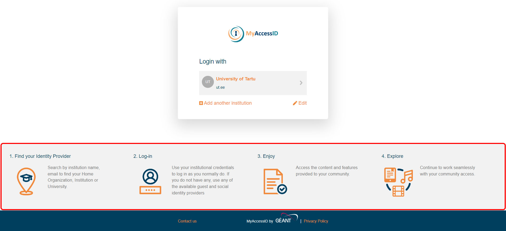

Virtual Desktop demo can be reviewed [here](https://youtu.be/DCq_wRsP43Y).

## Adding HPC cluster nodes / Rocket cluster account

Rocket is a heterogeneous HPC cluster that currently consists of about 175 compute nodes, featuring almost 7000 cores, a bit over 40 terabytes of memory and 40 GPUs, interconnected by high-speed low-latency Infiniband networking. The cluster also utilizes two General Parallel File systems, which in sum total provide almost 10 petabytes of usable storage space.

- To order a Rocket cluster account select "HPC" category in the Marketplace.

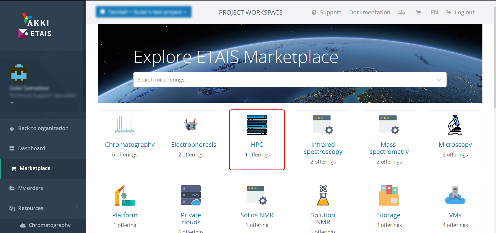

- Choose the "Rocket (UT HPC)" from the HPC resources list.

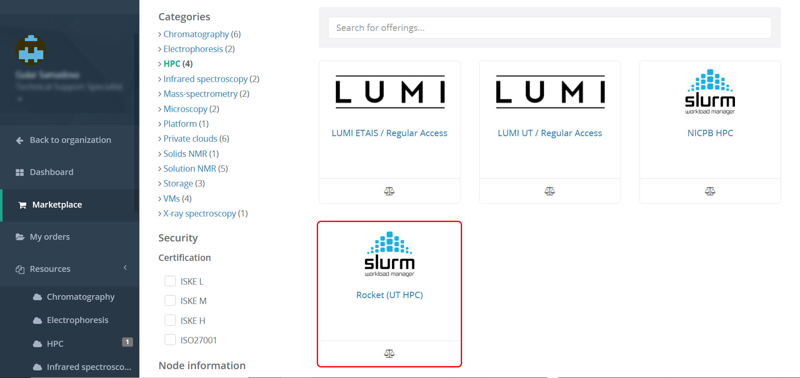

- Once filled and validated “Allocation name” and “Allocation description” fields, click on “Add to cart” to proceed to provision.

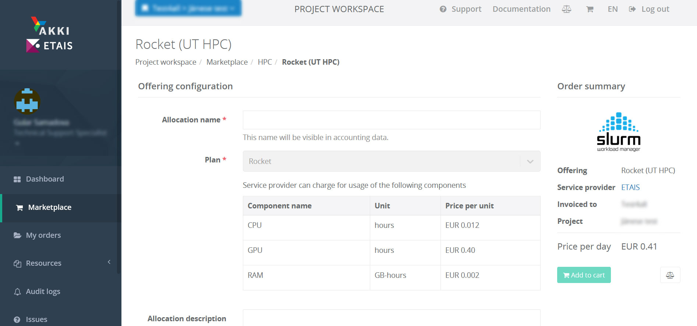

- After the provisioning has started, you can see the details in the configuration detail view. Please review the request and if everything is correct, click “Purchase”.

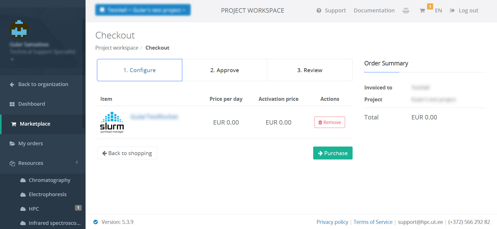

- To finish ordering the account follow steps as in ["Adding a Virtual Desktop"](https://etais.ee/self_service/#adding-a-virtual-desktop) starting with step 5. 
Also you can find the guide for "Organization Owner Approving a Service Order" in the same section.

## Adding or changing SPU and GPU memory limits

> *Please note! Only Staff users are allowed to add or change CPU and GPU memory limits.*

- In order to get this action done, Organization owner or PI has to send request to support@hpc.ut.ee.

## VPC Security Groups management

Security Groups are scoped and managed under VPC package. For managing Security Groups and their rules please go into VPC detailview by clicking on provisioned VPC package name.

Existing Security Groups present within current VPC are listed under "Security groups" tab.

For adding new Security Group please click on "Create" button.

It is required to enter Security Group name and to add at least one rule. We recommend adding a description as well.

## Adding a batch queue allocation

> *In order to be able to use batch queues in ETAIS you need to setup your FreeIPA profile. You can do it in [your profile](https://minu.etais.ee/#/profile/freeipa-account/).*

Batch resource allocation in one of ETAIS HPC centers can be created by selecting "Batch processing" from Marketplace
or by going to "Resources: Batch processing" and clicking on "Create" button.

After selecting an HPC provider, you will be able to fill in the form setting the planned monthly limits
for the batch resources. Accounting for resources is usage based, summary on the right will show the maximum
cost of all limits are reached. Provision allocation by clicking on "Purchase" button.

Once allocation has been created, you can see its access information:

1. Login information for SLURM head node. You will be able to use your FreeIPA account and any of the uploaded public SSH keys.
2. Account ID that needs to be passed to *sbatch* command when scheduling a job.

## Adding a Kubernetes cluster

Kubernetes (K8s) clusters are created and managed using [Rancher](https://rancher.com/docs/rancher/v2.x/en/) 
management server. K8s clusters are deployed into a selected OpenStack Project (aka VPC), so it must exist before
cluster can be created.

To create a K8S cluster select "Platform" category in the Marketplace.

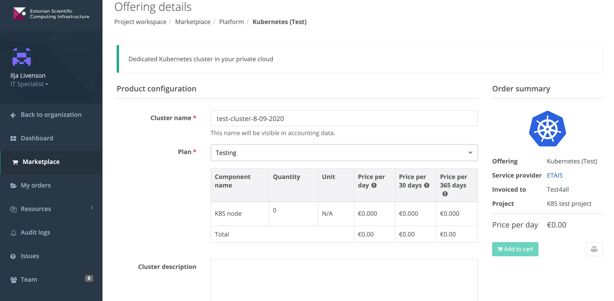

Fill in the form for cluster creation. The following settings need to be defined:
- SSH public key to inject as authorized key into K8S nodes;
- Define private cloud where to deploy K8s as well as subnet where the nodes should be connected to.
- Define a K8s node plan, specifying roles, flavors and sizes.

Once the form is filled and validated, click on Purchase to proceed to provisioning. 

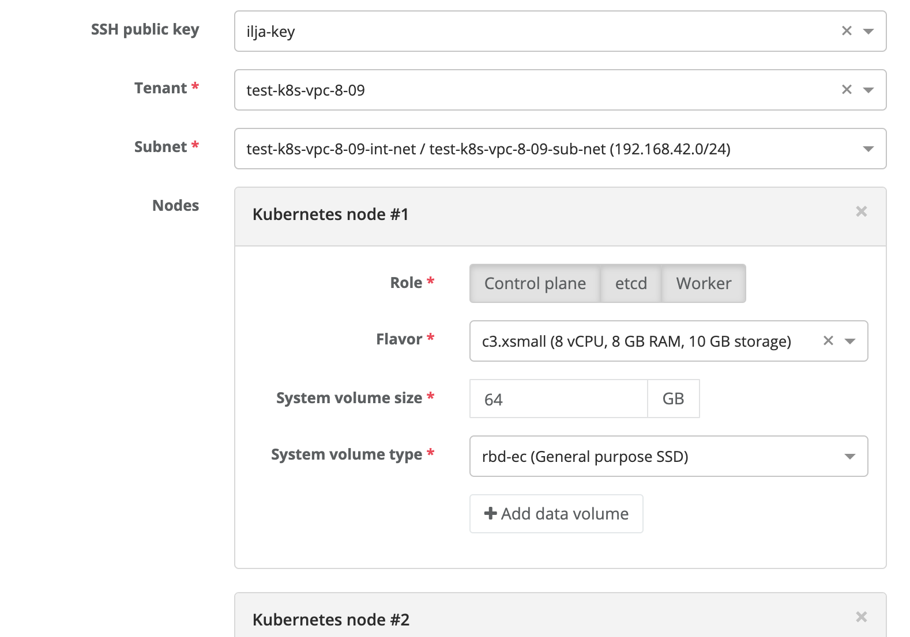

Please note that creating a cluster takes on average 10 minutes per node.

Once the provisioning has started, you can see the details in the K8s detail view. During the
initial creation, nodes are created one-by-one and added to the cluster. Note the linked OpenStack
VMs - by default nodes are provisioned with internal IPs only. If you want to add Load Balancer or
connect K8s directly to external network, please use the corresponding VM management.

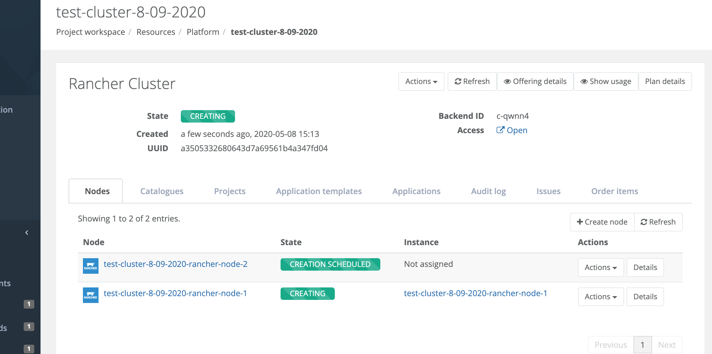

Note that if an OpenStack Instance is part of a K8S cluster, it will include a short-cut link in
its detail view.

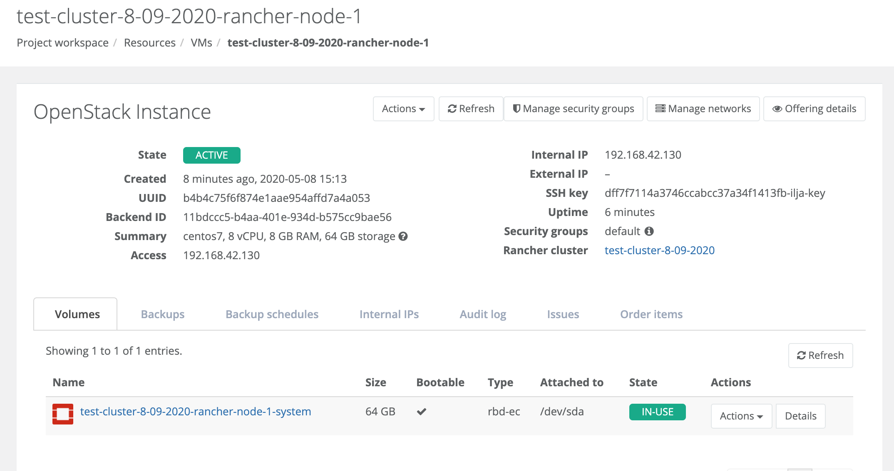

Once created, it is possible to access K8s cluster also via Rancher management. Link is available
from the cluster detail view. Rancher provides a rich set of options for management of K8s clusters.
Initial access credentials are generated and e-mailed to users with access to cluster (project and organization roles)
after the cluster is created. Note that if you already have access credentials, they won't be created
each time, instead permissions for your account would be added.   

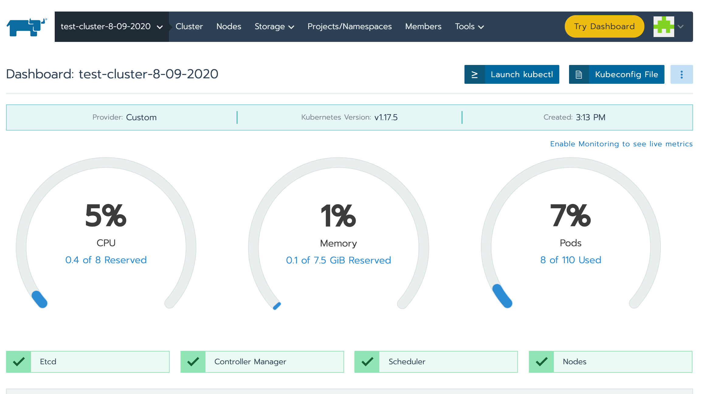

Once the cluster is active, you can also download kubeconfig file to access and manage K8s cluster.
Please use Actions -> Generate Kubeconfig file for that.

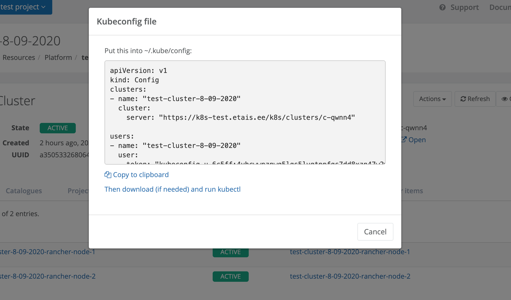

## Using GPU accelerator in a VM

GPU servers can be added by selecting  “Resources” and “VMs” from the menu and clicking on “Add resource” button.

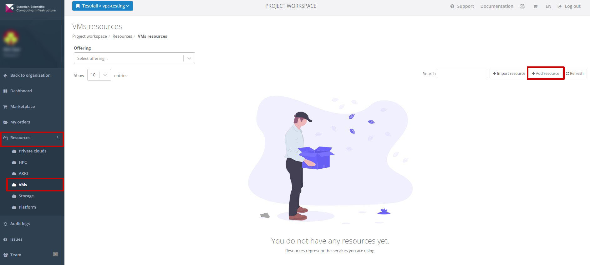

Once new resource is added, select GPU serverid UT HPC

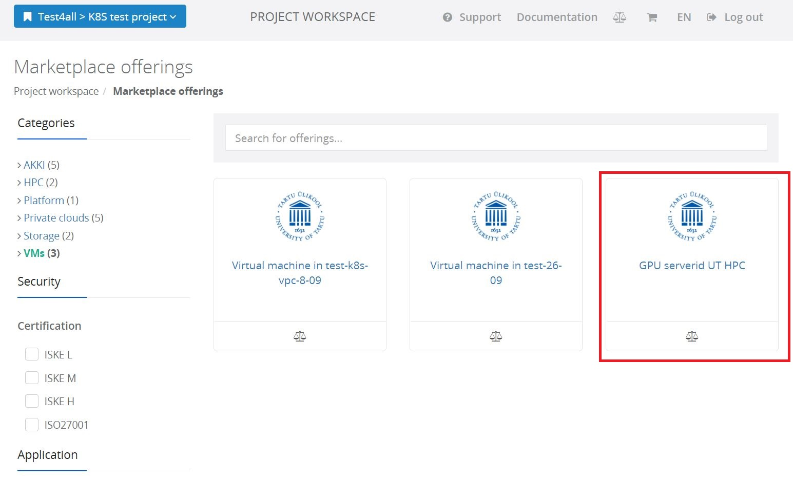

Please choose name and plan for the offering, select correct tenant and click "Add to cart".

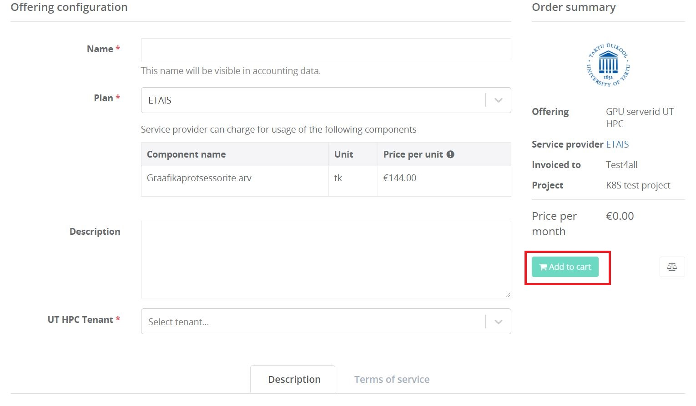

Please review the request and if everything is correct, click "Purchase".

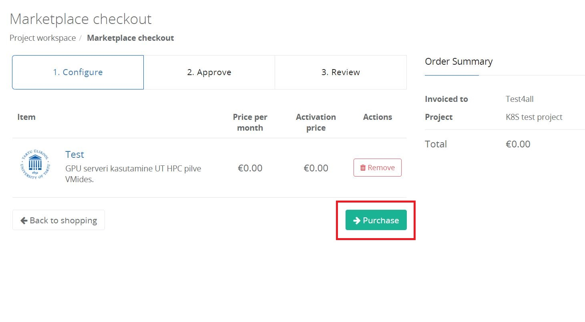

Now your request will be processed and you should receive notification about the acceptance soon.
