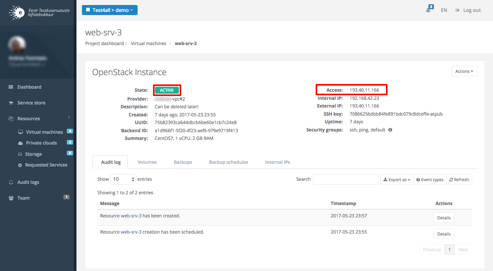

<a href="../terms_of_use/" class="btn-info"> Terms of use</a>
<a href="../start_using/" class="btn-info"> Start using</a>
<a href="../self_service/" class="btn-success"> Self-service guide</a>
<a href="../openstack_flavors/" class="btn-info"> OpenStack flavors</a>



## Overview
ETAIS self-service portal is a single entry point for provisioning and managing computational and storage resources
shared by ETAIS consortium members - UT, TTU, NICPB and HITSA - as well as public cloud providers. It is aimed at
research groups affiliated with Estonian research and development institutions from both public and private sector.

> Access it at [https://minu.etais.ee](https://minu.etais.ee).

Self-service portal offers research groups a way to collaborate on using and sharing research infrastructure to
minimise bureaucracy of negotiating access, quotas and payments.

The main concepts are as follows:


* **Organization** is a standalone entity that represents a research group or a company. Organization is responsible for the 
actions of users connected to it in different [roles](#roles).
* **Project** is an entity within an organization that aggregates and isolates teams and resources.
* **Provider** is an entity that represents account in an external service provider.
  * **Private providers** - providers that are available and manageable within a specific organization.
  * **Shared providers** - global providers that are available for all organizations. This includes HPC, cloud and storage infrastructure from ETAIS consortium.
* **Resource** - an entity within a project and a provider. Represents cloud resource. Examples: virtual machine or volume in OpenStack, quota in batch processing queue.

ETAIS self-service portal is based on [Waldur](https://waldur.com) cloud brokerage platform. The latest documentation is available from
[docs.waldur.com](http://docs.waldur.com). Below are key aspects adapted for ETAIS deployment.

## Service store

Service Store provides a common way to provision resources from both shared and private service providers.

The following resource types are offered at the moment:

* Virtual Private Cloud (VPC) - a pool of resources dedicated to a particular organization.
* Virtual Machines (requires pre-provisioned VPC) - a server with network connectivity for running customer payloads.
* Block Devices (requires pre-provisioned VPC) - persistent volumes for storage of the data.
* Batch (TBD) - access to Slurm-based processing farms.

### VPC Details
* Virtual Private Cloud (VPC) is a compute service that allows procuring and managing a pool of virtualized infrastructure
resources - like RAM, CPU, storage volumes and network resources - required to run virtual machines.
* VPC package does not limit VM count - it depends on VM flavors used and total resources available in a chosen package.
* VPC packages can be upgraded and downgraded at any moment.
* VPC packages are accounted daily based on the price of the largest resource package that was selected during the day.

## User accounts
ETAIS self-service portal supports user accounts coming from [TaaT](http://taat.edu.ee) federated identity system,
which allows to use home organisation accounts for login. Most of the larger education and research institutions in
Estonia are connected to TaaT already.

Alternatively, one can login using an account from [eduGAIN](https://www.geant.org/Services/Trust_identity_and_security/eduGAIN).

Self-Service Portal is available from: [https://minu.etais.ee](https://minu.etais.ee)


> *NB! Users need to accept Terms of Service presented on the first login for account activation!*

## Workspaces
ETAIS self-service is built around the concept of workspaces. Workspace defines structural context for the 
user. Each workspace type shows information and possible actions relevant to the user in a certain role.
There are several workspace types available in the system:

* [Organization workspace](#organization-workspace)
* [Project workspace](#project-workspace)
* [User workspace](#user-workspace)

## Roles
Users are connected to the organizations and their projects through roles. Users may have several roles, specific to
each workspace they have access to. Currently the following roles are available in the system:

* Organization owners (owners)
* Project managers (managers)
* System administrators (admins)

User roles are hierarchical in a way that organization owners can do everything that project managers and system administrators can do.

### Organization Owners
* Can access organization workspace.
* Can invite other users to participate in the organization.
* Can create and manage projects, including policies and cost limitations.
* Can manage resource providers and set their availability within projects.
* Can do everything that project managers and system administrators can do.

### Project Managers
* Can access project workspace when appointed by organization owner.
* Can manage project team from the users already connected to the organization.
* Can do everything that system administrators can do.

### System Administrators
* Can access project workspace if appointed by organization owner or project manager.
* Can provision and manage cloud resources.

## User workspace
User workspace is a personal profile management space. It allows to configure user notifications,
SSH public keys, update personal profile data etc.


Menu entries available within user workspace:

* **Dashboard**: listing all organizations and projects where user is participating
* **Audit logs**: listing events related to user
* **SSH keys**: managing public SSH keys for the user
* **Notifications**: managing notifications for the user
* **Manage**: editing and updating user profile details

### Accessing user workspace

Access is done by clicking on user avatar and selecting one of the entries from a pop-up menu.


## Adding a public SSH key to a profile
1. Generate your SSH keypair (on Windows: using PuTTYgen, Linux: using OpenSSH).
2. Click "Details" on the left side of the screen.
3. Select "SSH keys".
4. Click "Add SSH key".
5. Paste there contents of a public SSH key.


### Organization and project workspace selector
Navigation between different organization and project workspaces are done with the help of the workspace selector available in the header row.


### Selecting organization workspace
Open workspace selector and click on "Select" button of target organization.


### Selecting project workspace
Open workspace selector, mark target organization and click on "Select" button of target project.


## Organization workspace
Organization workspace allows to manage projects, subscriptions to resource providers and organization members. It is also intended to provide summary, accounting and auditing information regarding organization, projects and providers. To be able to access organization workspace, you need to have a organization owner role.


Menu entries available within organization workspace:

* **Dashboard**: overview of managed resources and projects
* **Providers**: resource providers management (system and provisioned providers)
* **Projects**: projects management
* **Service store**: catalog of resources and providers, available for provisioning 
* **Analytics**: resource usage reports
* **Audit logs**: event logs related to organization, its projects and resources
* **Team**: management of organization members and their project/role accreditations
* **Accounting**: resource usage accounting information
* **Manage**: management of organization details

### Adding a project
Projects can be added by selecting "Projects" from the menu and clicking on "Add project" button. 


"Create project" form requires you to enter project name and optionally project description. If you need to attach security class label for the project you should select one from the list presented. Submit form by clicking on "Add project" button.


### Inviting a user
User workspace access and role management can be done on two separate levels:

* Organization workspace allows owners to invite users as organization members and to manage their project role assignments.
* Project workspace allows project managers to assign available organization members a role in their project.

Organization level invites can be created by selecting "Team" from the organization workspace menu and clicking on "Invitations" management tab.


For creating a new invitation please click on "Invite user" button.


> *NB! By sending an invite to a user you also accredit this user to become an organization member! In order to complete
the joining process invited user needs to login with the URL provided in the invitation email.*  

"Invite user" form requires target user email address, initial project and role selection. Submit form by clicking on "Invite user" button.


## Project workspace
Project workspace provides tools and information required for day-to-day work and oversight over the managed IT infrastructure. Access is done via workspace selector in the top section of user interface.


Menu entries available within project dashboard:

* **Dashboard**: overview of project resources and latest events
* **Service store**: catalog of resources and providers, available for provisioning
* **Resources**: provisioned resource listings and management views by resource category (VMs, Private Clouds, Storage, etc.)
* **Audit logs**: event logs related to project and its resources
* **Team**: project team management

## Adding a VPC
Virtual Private Cloud resource package can be added by selecting "Resources" and "Private Clouds" from the menu and clicking on "Add private cloud" button.


> *NB! There are several Virtual Private Cloud providers available from the Service Store. You need to provision at least one VPC package
from suitable provider in order to be able to create virtual machines.*


It is mandatory to input VPC Tenant name and choose initial resource package, by clicking on "VPC package: Show choices" selector.


Currently there are four VPC resource packages categories listed: trial, small, medium and large. Each category can have several resources packages mapped. For selecting a VPC resource package please mark suitable package entry and click on "Select" button, returning to the previous form.


We also strongly suggest to fill also VPC description field. Other input fields are autofilled and can be optionally customized, if required. "Checkout summary" on the right pane will provide detailed overview of VPC resouce package purchase.


> *NB! Provisioned VPC resource package will be automatically enabled for the project as a VM provider! For other projects it can be enabled by the organization owner under Provider management within organization workspace.*

## Adding a VM
> *Projects need to have at least one VPC resource package enabled, before any virtual machines can be created!*

VMs can be added by selecting "Resources: Virtual machines" from the menu and clicking on "Add virtual machine" button. 


In case you have multiple VPC providers enabled within the project you will need to select also VM provider. "Create Openstack instance" form requires VM name and selection of VM image.


Please select operating system for a VM and click on "Select" button, returning to the form.


It is mandatory to select initial VM resource profile ie flavor, by clicking on "Flavor: Show choices" selector.


Flavor will set initial resource profile for a VM - how much RAM, CPU cores and storage it will have.

> *NB! VM images contain their minimum requirements information and non-matching VM flavors are disabled automatically!*


Selecting VM flavor will also update "System volume size" with the option to override it manually (to higher custom value). Data volume is always provisioned with a VM and its size can be customized and incremented in 1GB steps. 

By default provisioned virtual machines expect users to login using SSH keys. Initial SSH key for a login should be selected by clicking on "SSH public key: Show choices" selector.

> *There has to be at least one SSH public key added to user profile for it to appear in SSH key selector list!*


> *NB! Different VM images have different default user names for SSH logins! For example: CentOS images use "centos" user, Ubuntu images use "ubuntu" user, Windows images use "Administrator" user.*


By default no incoming connections will be allowed for a VM. Predefined Security Groups that contain firewall rules must be linked to a VM in order to open up access (like ssh, http, etc).

> *NB! VM create form will automatically include "default" security group which enables egress (ie outgoing) traffic for a VM and which is required in order to reply to any of the incoming packets!* 


VM needs to be connected to at least one of the VPC (internal) networks and also to external network via floating IP - if extenal/public access to VM is required. 

> *Floating IP is technically realized as 1:1 NAT between VM internal ip and public network ip.*


We strongly suggest to add also VM description. In order to provision the VM please click on "Purchase" button.

> *On the right pane there will be "Checkout summary" with the purchase overview and indicative VM cost (as part of VPC package cost).*


VM should reach into "Active" status when successfully provisioned. "Access" field will show IP address to access VM over SSH (Linux) or over RDP (Windows). 

> *VM access over SSH or RDP should be permitted by Security Groups linked to VM!*

> *OpenStack VPC VMs will have additional 64MB virtual hard disk attached to VM which functions as cloud-init configuation drive (not supported by self-service yet, only user-data support at the moment).*



## VPC Security Groups management
Security Groups are scoped and managed under VPC package. For managing Security Groups and their rules please go into VPC detailview by clicking on provisioned VPC package name.


Existing Security Groups present within current VPC are listed under "Security groups" tab.


For adding new Security Group please click on "Create" button.


It is required to enter Security Group name and to add at least one rule. We recommend adding a description as well.


## Adding a batch queue allocation

> *In order to be able to use batch queues in ETAIS you need to setup your FreeIPA profile. You can do it in [your profile](https://minu.etais.ee/#/profile/freeipa-account/).*

Batch resource allocation in one of ETAIS HPC centers can be created by selecting "Batch processing" from Service Store
or by going to "Resources: Batch processing" and clicking on "Create" button.


After selecting an HPC provider, you will be able to fill in the form setting the planned monthly limits
for the batch resources. Accounting for resources is usage based, summary on the right will show the maximum
cost of all limits are reached. Provision allocation by clicking on "Purchase" button.


Once allocation has been created, you can see its access information:

1. Login information for SLURM head node. You will be able to use your FreeIPA account and any of the uploaded public SSH keys.
2. Account ID that needs to be passed to *sbatch* command when scheduling a job.


## Python management service

### Prerequisites

1. Your project in ETAIS has a Private Cloud. Please refer to [Adding a VPC](#adding-a-vpc)
2. Your account has your SSH public key. Please refer to [Adding public SSH key](#adding-a-public-ssh-key-to-a-profile)
3. A virtual machine is created and properly configured. For details please refer to [Adding a VM](#adding-a-vm)
   * Make sure image is either Debian 9 or Ubuntu 16.04.
   * Select your previously uploaded SSH public key in the form.
   * "SSH" and "Web" security groups should be assigned.
   * "Auto-assign a floating IP" option in "Networks" combobox should be selected (or any existing IP address).
4. Wait for the VM to start.

>If you cannot connect to a newly created VM at once, wait for several minutes to make sure that OS has booted and SSH daemon has been started.

VM configuration is depicted on the following screenshot:


Now, navigate to Resources -> Applications on the left. Then press "Create application" in the top right corner of the table and select "Python management":


Before saving the form, follow the instructions under “Virtual machine has cloud broker public key” checkbox:

1. Find out External IP of your VM
   

2. For Windows users: Connect with PuTTY (private key should correspond to the public key you uploaded to ETAIS!) to your VM
   

3. Linux/MacOS: Use OpenSSH client: `ssh TARGET_USER@VM_EXTERNAL_IP`

Once you are logged in (default system user depends on a distribution: either `debian` or `ubuntu`), copy the cloud broker public key from the Python management creation form (to show it, press "Show key" under "Virtual machine contains a public key of the cloud broker" checkbox) and paste it into `/home/TARGET_SYSTEM_USER/.ssh/authorized_keys`


Now you can proceed with Python management form and afterwards continue with a [JupyterHub management](#jupyterhub-management-service).

### Details screen elements


> Virtual environments are managed using virtualenv and virtualenvwrapper utilities.

Python management service is not notified when you install additional libraries manually. If you install any libraries or create new virtual environments directly via SSH, click either "Find missing libraries" or "Find installed virtual environments & libraries".

Following list describes each element of Python management details screen:

1. Button to propagate changes to a virtual machine (install/delete libraries, create/delete virtual environments)
2. Virtual environment name (a folder inside Virtual environments root directory)
3. Download installed libraries list in a form of [requirements file format](https://pip.pypa.io/en/stable/user_guide/#requirements-files). Currently supports only exact versions of packages: pkg==1.1
4. Upload `requirements.txt` for installation in a virtual environment. New libraries will appear in the form, save the form to apply the changes.
5. If any libraries were installed manually using pip through SSH (or via Jupyter notebooks), you need to synchronize that virtual environment with ETAIS using this button (otherwise new libraries will not appear in a virtual environmnet)
6. If any virtual environments were manually installed/removed in Virtual environments root directory, you need to synchronize the state with ETAIS by clicking this button (otherwise new virtual environment will not appear).
7. A brief guide which tells you how to manually install libraries via SSH.
8. Each action performed by ETAIS on a VM is logged in Actions history tab.
9. Expand virtual environment (shows list of libraries)

## JupyterHub management service

Before using JupyterHub, please setup [Python management service](#python-management-service) on a VM.

Once provisioned, JupyterHub configuration file is located in ```/etc/jupyterhub/jupyterhub_config.py```. All changes manually applied to JupyterHub configuration files will not be reflected in JupyterHub details form. Moreover, each time you click "Apply configuration" button, the existing configuration file is completely replaced with the new one generated out of the currently saved state in ETAIS. However, the backup for old configuration file is created in the same folder.

JupyterHub management service is not notified if you change, for example, admin rights through JupyterHub GUI - do it through self-service.

### Details screen - manual JupyterHub user entry


Following list describes each element of JupyterHub management details screen:

1. Virtual environments come from Python management service.
2. It is possible to make these virtual environments accessible as Jupyter kernels. All JupyterHub users will have access to them. However, they will not be allowed to install or remove libraries through notebook or SSH in these kernels.
3. There are 2 types of authentication methods available. In both cases JupyterHub users correspond to Linux system users.
 * Linux PAM: you need to manually define JupyterHub users. Corresponding system users will be created once "Apply configuration" button is pressed.
 * OAuth: see the next section. Corresponding system users will be created on first login.
4. Apply configuration (currently active Jupyter users will experience short connection outage with JupyterHub).
5. Passwords for already created users are not stored in ETAIS database. Password should be defined only for new users (form validation will guide you).

### Details screen - OAuth2 authentication method


Following list describes elements of OAuth2 section:

1. Currently there are 2 supported OAuth providers: GitLab and Microsoft Azure.
2. External link to a GitHub page where it is explained how to configure authentication for each OAuth provider.
3. At least one admin should be specified. All special characters in usernames will be replaced with underscores _ once config is saved.
4. By default, any OAuth user can login to JupyterHub. If you want to prevent that from happening, you can specify that only specified admins are eligible to log in.
5. If you want to add additional users who are allowed to log in, specify them here.

### How to restart JupyterHub via SSH

If you need to manually restart JupyterHub via SSH, execute the following commands. Normally, there is no need in doing that, since when JupyterHub details screen is saved, all changes will be applied and JupyterHub restarted).

Stop JupyterHub process:

```supervisorctl stop jupyterhub```

Kill configurable-http-proxy process:

```sudo pkill node```

Start JupyterHub process:

```supervisorctl start jupyterhub```

